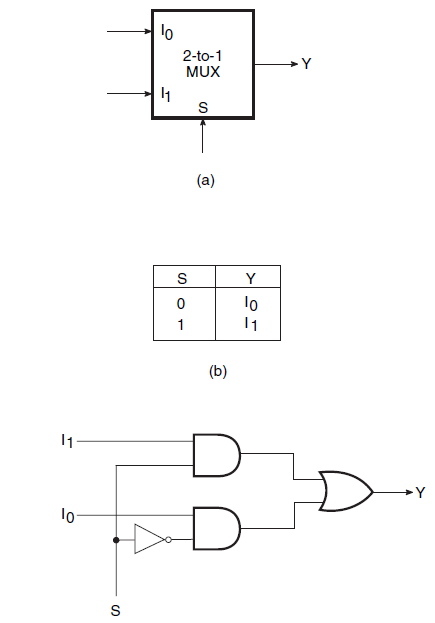
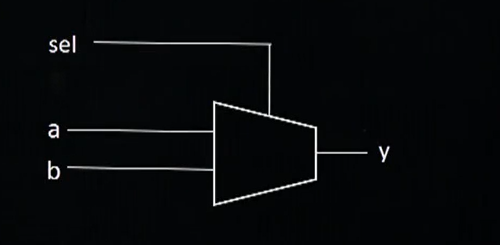
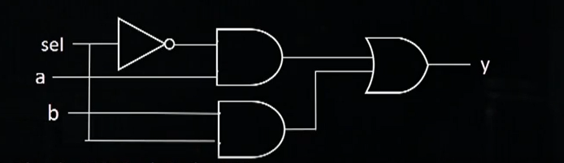

**What is Multiplexer?**   
A Multiplexer (or mux;), also known as a data selector, a combinational logic circuit,  is a device that selects between several analog or digital input signals and forwards the selected input to a single output line.The selection is directed by a separate set of digital inputs known as select lines. A multiplexer of  '2^n' inputs has 'n' select lines, which are used to select which input line to send to the output.
 

**assign y = sel ? a : b ;**         
This operator ? means that the output 'y' becomes equal to data 'a' if select line 'sel' is true otherwise 'b' is the final output. 

The input signals are 'a' and 'b'. 'sel' is the select line with 'y' as its output. We can orally solve for the expression of the output that comes out to be:

                        y = a.(sel)’ + b.(sel)

 
**Logic Diagram and Truth Table :**
  
 
  
  
 

